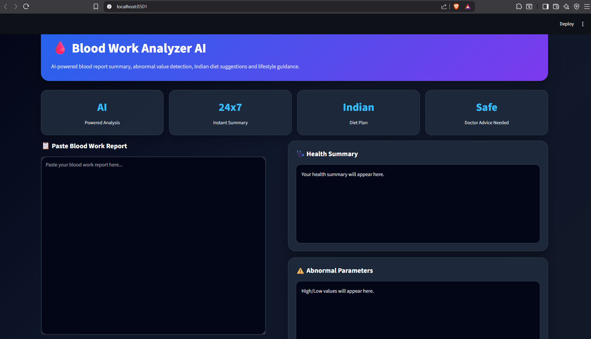
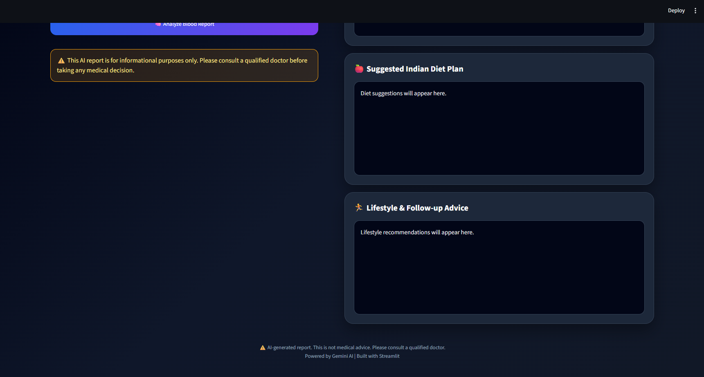
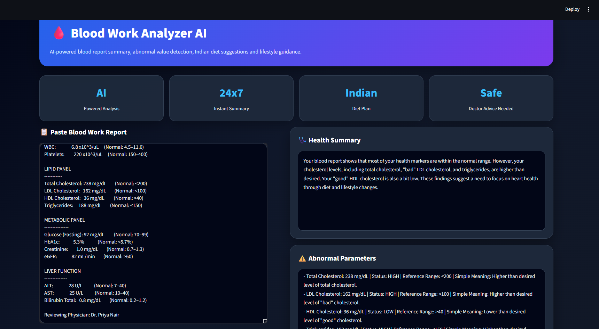
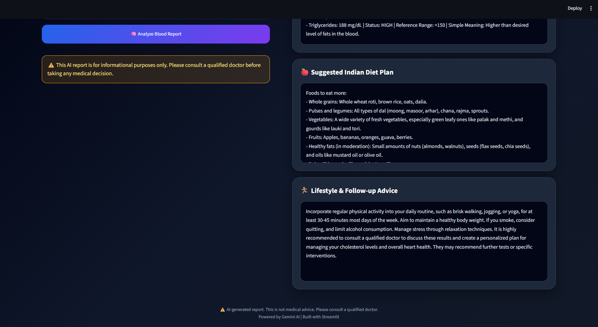

# 🩸 Blood Work Analyzer

An AI-powered web application that analyzes blood test reports and generates an easy-to-understand health summary along with a personalized Indian diet plan using Google's Gemini Large Language Model (LLM).

Built with **Python**, **Streamlit**, **LangChain**, and **Google Gemini**, the application helps users better understand their blood test results without needing medical expertise.


---

## ✨ Features

* 📄 Paste any blood test report for instant analysis.
* 🔍 Automatically extracts all blood parameters.
* 📈 Classifies values as **High**, **Low**, or **Normal** based on reference ranges.
* 🩺 Generates a simplified health summary in plain English.
* 🥗 Recommends a practical Indian diet plan based on the analysis.
* 💻 Clean and responsive Streamlit interface.
* ⚡ Powered by Google's Gemini AI through LangChain.

---

## 🚀 Tech Stack

* Python
* Streamlit
* LangChain
* Google Gemini API
* python-dotenv

---

## 📂 Project Workflow

```text
Blood Report
      │
      ▼
Extract Blood Parameters
      │
      ▼
Identify High / Low / Normal Values
      │
      ▼
AI Health Analysis
      │
      ▼
Generate Health Summary
      │
      ▼
Recommend Indian Diet Plan
      │
      ▼
Display Results in Streamlit UI
```

---

## 📸 Screenshots

## 📸 Application Preview

| Dashboard | AI Analysis |
|-----------|-------------|
|  |  |

| Diet Plan | Final Report |
|-----------|--------------|
|  |  |

---

## ⚙️ Installation

```bash
git clone https://github.com/sumitcoin/BloodWorkAnalyzer-AI.git

cd BloodWorkAnalyzer-AI

python -m venv .venv

# Windows
.venv\Scripts\activate

# Linux / macOS
source .venv/bin/activate

pip install -r requirements.txt
```

---

## 🔑 Environment Variables

Create a `.env` file in the project root.

```env
GOOGLE_API_KEY=YOUR_GEMINI_API_KEY
```

---

## ▶️ Run the Application

```bash
streamlit run app.py
```

---

## 💡 How It Works

1. Paste your blood report into the application.
2. Gemini AI extracts all test parameters and reference ranges.
3. Each value is classified as **High**, **Low**, or **Normal**.
4. AI generates an easy-to-understand health summary.
5. A personalized Indian diet plan is suggested based on the findings.

---

## ⚠️ Disclaimer

This application is intended for educational and informational purposes only. It is **not a substitute for professional medical advice, diagnosis, or treatment**. Always consult a qualified healthcare professional regarding medical concerns.

---

## 🚀 Future Enhancements

* 📤 Upload PDF blood reports
* 📊 Charts and health trends
* 📈 Historical report comparison
* 👨‍⚕️ AI doctor chat assistant
* 🥗 Weekly meal planner
* 🏃 Lifestyle recommendations
* 📄 Downloadable PDF reports
* 🌍 Multi-language support
* 📱 Mobile-friendly UI

---

## ⭐ Support

If you found this project useful, consider giving it a ⭐ on GitHub!
